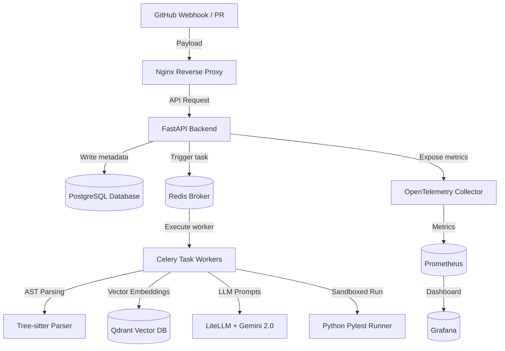
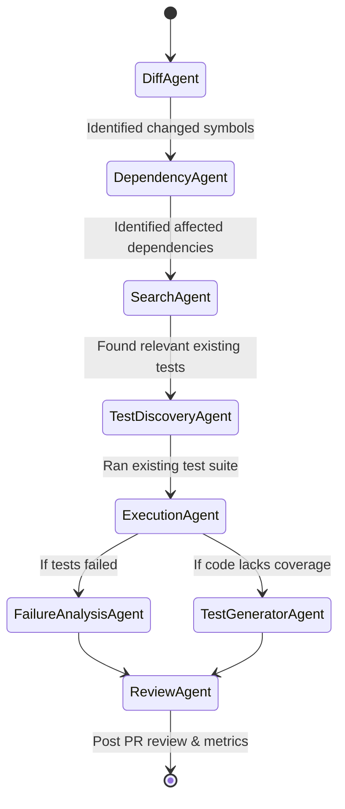

# TestPilot AI — Project Overview & Architecture

TestPilot AI is an advanced, production-grade **AI-Powered Regression Testing and Automated Code Review Platform**. It connects directly to your GitHub repository and automatically runs static analysis, AST-based impact mapping, sandboxed test execution, and generative test creation on every incoming Pull Request (PR).

---

## 🚀 Key Capabilities

1. **Automated PR Reviews**: Generates senior-engineer-level, structured markdown feedback directly in GitHub PR comments.
2. **Impact & Dependency Mapping**: Uses Tree-sitter AST parsing to trace exactly which functions, classes, and REST endpoints are impacted by code changes.
3. **Sandbox Test Execution**: Automatically spins up isolated environments to run modified or newly-added tests.
4. **Generative Test Writing**: Uses Gemini 2.0 Flash (via LiteLLM & Instructor) to automatically author missing test suites for untested changed code lines.
5. **AI Failure Analysis**: If tests fail, an AI analysis agent inspects traceback outputs to pinpoint the precise root cause.

---

## 🛠️ Technology Stack & Core Infrastructure



### 1. Backend Service (`backend/`)
* **FastAPI**: Asynchronous web API powering the user dashboard and webhook handlers.
* **SQLAlchemy & Asyncpg**: Async database engine for metadata tracking (repositories, PRs, test runs).
* **Alembic**: Database schema migration manager.

### 2. Async Workers (`backend/app/workers/`)
* **Celery & Redis**: Task queue and broker handling long-running background tasks (cloning repositories, building indexes, executing test suites).

### 3. Vector database (`Qdrant`)
* **Qdrant**: Stores semantic vector embeddings of code chunks (classes, functions, test definitions) using local `SentenceTransformer` models, enabling contextual codebase retrieval for LLMs.

### 4. Language Models & AI Agent Orchestration (`backend/app/agents/`)
* **LangGraph**: Framework for structuring agentic state machines.
* **LiteLLM**: Standardized LLM interface configured to route queries to **Google Gemini 2.0 Flash**.
* **Instructor**: Enforces type-safe Pydantic structured schemas on LLM outputs (e.g. PR reviews, test suite models).
* **Tree-sitter**: Multi-language AST parser (Python, Javascript, Typescript, Rust, Go, Java) used to parse codebases and map relationships.

### 5. Frontend Dashboard (`frontend/`)
* **Next.js**: Premium UI offering real-time PR health monitors, coverage deltas, failure diagnostics, and test suite logs.

---

## 📂 Project Directory Structure

```
TestPilot AI/
├── .github/workflows/          # GitHub Actions CI/CD pipelines
│   └── ci.yml                  # Runs Ruff, Mypy, and Pytest on commits
│   └── cd.yml                  # Builds and pushes Docker images to GHCR
├── backend/                    # Core Backend codebase
│   ├── app/
│   │   ├── agents/             # LangGraph agent state machines & logic
│   │   ├── api/                # FastAPI routers (webhooks, auth, AI chat, dashboard)
│   │   ├── core/               # Configuration, logging, telemetry settings
│   │   ├── database/           # DB session creation and SQLAlchemy base
│   │   ├── middleware/         # Custom CORS, Request ID, and Rate Limiters
│   │   ├── models/             # SQLAlchemy ORM definitions (PR, TestRun, User)
│   │   ├── repositories/       # Data Access Object pattern wrappers
│   │   ├── schemas/            # Pydantic schemas for request/response bodies
│   │   ├── services/           # Services (AST parsing, Embedding, GitHub API)
│   │   ├── tasks/              # Celery background tasks (indexing, pipelines)
│   │   ├── utils/              # Helper utilities (Git operations, shell run)
│   │   └── workers/            # Celery initialization configuration
│   ├── alembic/                # DB migrations configuration & versions
│   ├── tests/                  # Unit & integration pytest suites
│   ├── pyproject.toml          # Poetry package dependencies & tools setup
│   └── Dockerfile              # Docker runtime build instruction
├── frontend/                   # Next.js Frontend Dashboard code
│   ├── src/
│   │   ├── app/                # Next.js App router pages (dashboard, repos, PRs)
│   │   ├── components/         # Shared dashboard UI widgets
│   │   └── lib/                # API clients and helpers
│   └── package.json            # NPM dependencies configuration
├── infra/                      # Orchestration infrastructure scripts
│   ├── nginx/                  # Nginx proxy routing configuration & TLS config
│   ├── prometheus/             # Metrics scrape configurations
│   └── grafana/                # Grafana data sources & dashboards configurations
├── docker-compose.yml          # Local multi-service launcher configuration
└── .env                        # Configuration environment variables
```

---

## 🤖 The AI Agent Pipeline (LangGraph Workflow)

When a GitHub PR webhook is received, Celery initiates the **PR Analysis Agent Graph**:



1. **`DiffAgent`**: Fetches the raw PR patch, parses changed line ranges using Tree-sitter, and registers updated functions, classes, and routes.
2. **`DependencyAgent`**: Traces imports to discover downstream modules and REST APIs that are impacted by changed components.
3. **`SearchAgent`**: Queries Qdrant to find semantically similar code snippets or historically buggy functions in the codebase.
4. **`TestDiscoveryAgent`**: Maps impacted files to their corresponding test suites.
5. **`ExecutionAgent`**: Runs the identified test files in a sandboxed process.
6. **`FailureAnalysisAgent`**: Triggered only if tests fail. Inspects stack traces to provide a structured explanation of the bug.
7. **`TestGeneratorAgent`**: Synthesizes newly added/modified code that has low coverage and writes unit tests to cover them.
8. **`ReviewAgent`**: Compiles all outputs, computes risk scores (0.0 to 10.0), and publishes a complete markdown report to the PR comment thread.

---

## 🗄️ Database Schema & Entities

The platform maintains metadata persistently in a PostgreSQL schema:

* **Users**: Stores administrative user accounts.
* **Repositories**: Tracks registered GitHub repositories, full names, default branches, and index statuses.
* **PullRequests**: Tracks active PR numbers, head SHAs, branch names, risk levels, and risk scores.
* **TestRuns**: Records execution statistics (passed/failed/skipped counts, coverage percentages, timestamps, raw log outputs).

---

## 💻 Local Setup & Run Checklist

### Prerequisites
* Docker Desktop installed and running.
* GitHub Developer App credentials configured (if syncing real webhook triggers).
* Gemini API Key (configured inside `.env`).

### Run Services Locally
1. Clone the repository.
2. Configure `.env` using `.env.example` as a baseline.
3. Start the entire platform via Docker Compose:
   ```bash
   docker-compose up -d
   ```
4. Verify the backend service health:
   ```bash
   curl http://localhost:8000/health
   ```
5. Open the frontend dashboard in your browser at `http://localhost:3000`.
