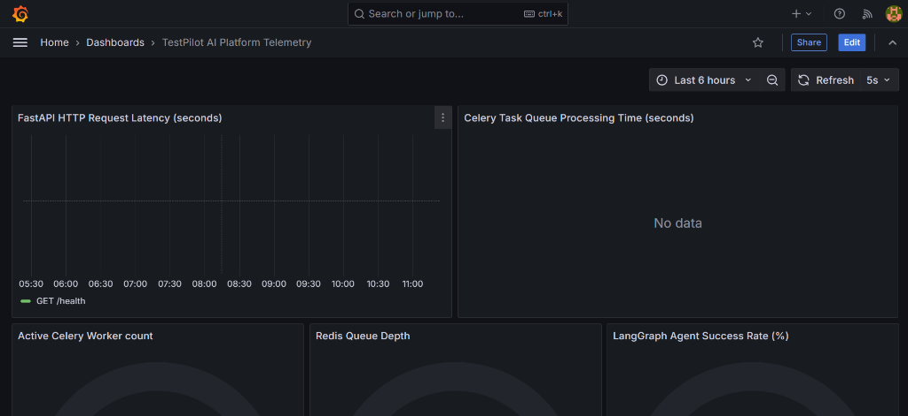
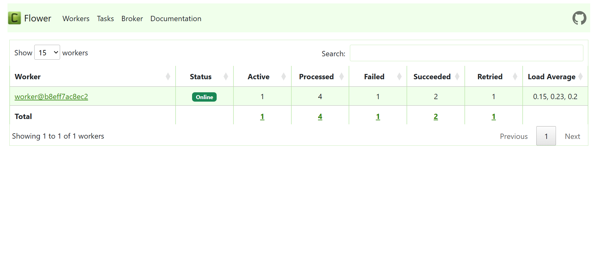

# TestPilot AI

[](https://github.com/Shikhaar/TestPilot-AI/actions)
[](https://github.com/Shikhaar/TestPilot-AI/actions)
[](LICENSE)
[](https://github.com/Shikhaar/TestPilot-AI/pulls)

> **AI-Powered Regression Testing & AST Code Indexing Platform for Modern Software Engineering Teams**


TestPilot AI is a production-grade AI platform that automatically parses GitHub repositories, indexes Tree-sitter AST symbol graphs, tracks dynamic test coverage, analyzes PR regression risks, generates unit test suites, and opens pull requests on GitHub.

---

##  Core Features

-  **Tree-Sitter AST Code Indexing**: Automatically parses functions, classes, imports, and API routes across TypeScript, JavaScript, Python, Go, Java, and Rust codebases.
-  **Dynamic README & Description Extraction**: Dynamically extracts repository metadata and documentation directly from local disk clones or GitHub APIs without hardcoded fallbacks.
-  **Real-Time Indexing Progress & Auto-Polling**: Interactive progress indicators and automatic UI polling keep users informed while repositories are being cloned and parsed.
-  **AI Unit Test Generation**: Generates production-ready unit test suites tailored to the codebase's specific language framework (PyTest, Vitest/Jest, JUnit, Go Test).
-  **One-Click GitHub PR Creation**: Automatically commits generated test files to a dedicated feature branch and opens a Pull Request on GitHub.
-  **Multi-Agent Risk Analysis**: LangGraph multi-agent pipeline analyzes PR diffs, builds dependency graphs, and scores regression risk.

---

##  System Architecture

```
                    ┌───────────────────────────┐
                    │      Next.js Frontend     │
                    │   (React 19 + Tailwind)   │
                    └─────────────┬─────────────┘
                                  │ REST / WebSockets / SSE
                                  │
                    ┌─────────────▼─────────────┐
                    │      FastAPI Backend      │
                    │  (Python 3.12 / Alembic)  │
                    └─────────────┬─────────────┘
                                  │
          ┌───────────────────────┼───────────────────────┐
          │                       │                       │
   ┌──────▼──────┐         ┌──────▼──────┐         ┌──────▼──────┐
   │ PostgreSQL  │         │    Redis    │         │   Qdrant    │
   │ (Relational)│         │ (Celery/WS) │         │ (Vector DB) │
   └─────────────┘         └─────────────┘         └─────────────┘
```

The engine uses a **multi-agent orchestration workflow** powered by **LangGraph**, consisting of 11 specialized agent nodes:

1. **Planner Agent**: Orchestrates pipeline entry and validates input parameters.
2. **Diff Agent**: Parses the Git diff and extracts modified AST symbols (functions, classes, variables).
3. **Dependency Agent**: Computes the dependency imports graph for affected symbols.
4. **Impact Agent**: Graph-traverses imported models/APIs to map regression scope.
5. **Search Agent**: Queries semantic embeddings in Qdrant to find contextually relevant codebase samples.
6. **Test Discovery Agent**: Discovers and indexes existing test structures.
7. **Test Generator Agent**: Synthesizes custom PyTest / Vitest test code to cover modified blocks.
8. **Execution Agent**: Executes test suites in insulated subprocesses.
9. **Failure Analysis Agent**: Explains test failures with actionable code patches.
10. **Review Agent**: Compiles code changes, quality risk metrics, and generated tests into a markdown review.
11. **Documentation Agent**: Identifies missing API docs and creates updates matching code changes.

---

##  Technology Stack

* **Frontend**: Next.js 15 (React 19, TailwindCSS, CSS Variables)
* **Backend**: FastAPI, SQLAlchemy 2, Alembic, Poetry, Pydantic v2
* **Agent Flow & Orchestration**: LangGraph, Tree-sitter, LiteLLM, Instructor, Sentence-Transformers
* **Background Tasks**: Celery, Redis, Kombu
* **Vector Storage**: Qdrant Vector DB
* **Observability & Infrastructure**: Docker, Docker Compose, Nginx, Prometheus, Grafana, OpenTelemetry

---

##  Observability & Task Telemetry

TestPilot AI comes out-of-the-box with production-grade monitoring dashboards for system metrics, HTTP request latencies, and distributed background worker queues.

### Grafana Telemetry Dashboard (`http://localhost:3001`)


### Celery Flower Worker Dashboard (`http://localhost:5555`)


---

##  Getting Started

### Prerequisites

* **Docker & Docker Compose** (WSL2 backend enabled if running on Windows)
* **Node.js v18+** (for frontend development)
* **Python 3.12** & **Poetry** (for backend development)

---

### Step 1: Clone & Configure Environment

Clone the repository and copy the environment template:

```bash
git clone https://github.com/Shikhaar/TestPilot-AI.git
cd TestPilot-AI
cp .env.example .env
```

Ensure the following variables are set in your `.env` file:
* `GEMINI_API_KEY` or `OPENAI_API_KEY`: Your AI provider API key (LiteLLM automatically routes to Gemini or OpenAI).
* `GITHUB_CLIENT_ID` / `GITHUB_CLIENT_SECRET`: Generated from your GitHub App (see Step 2 below).
* `GITHUB_APP_ID` / `GITHUB_APP_PRIVATE_KEY_PATH`: From your GitHub App settings.

---

### Step 2: Create Your Local GitHub App (2 Minutes)

To enable GitHub OAuth login and repository integration:

1. Go to **[GitHub App Registration](https://github.com/settings/apps/new)**.
2. Fill in the required fields:
   * **GitHub App name**: `TestPilot-AI-YourName`
   * **Homepage URL**: `http://localhost:3000`
   * **User authorization callback URL**: `http://localhost:3000/auth/callback`
   * **Webhooks**: Uncheck **Active** (Webhooks are optional for local development).
3. Under **Permissions**, grant:
   * **Contents**: Read & Write (for creating test branches and files)
   * **Pull requests**: Read & Write (for posting PR code reviews)
   * **Metadata**: Read-only
4. Click **Create GitHub App**.
5. Copy the generated **App ID**, **Client ID**, and generate a **Client Secret** and **Private Key** (`.pem` file), then update your `.env` file.

---

### Step 3: Local Webhook Relay with Smee.io (Optional)

If you want to test real-time GitHub `push` or `pull_request` webhooks on your local machine:

1. Go to **[smee.io](https://smee.io)** and click **Start a new channel**.
2. Copy your unique Smee URL (e.g. `https://smee.io/abc123xyz`).
3. In your GitHub App settings, check **Active** under Webhooks and paste your Smee URL as the **Webhook URL**.
4. Run the Smee client in a terminal to proxy incoming webhooks to your local FastAPI backend:

```bash
npx smee -u https://smee.io/YOUR_SMEE_CHANNEL_ID -t http://localhost:8000/api/v1/github/webhook
```

---

### Step 4: Launch Local Services

Start local infrastructure (PostgreSQL, Redis, Qdrant Vector DB):

```bash
docker compose up -d
```

#### Running Backend
```bash
cd backend
poetry install
poetry run uvicorn app.main:app --port 8000 --reload
```

#### Running Frontend
```bash
cd frontend
npm install
npm run dev
```

Visit **`http://localhost:3000`** in your browser!

---

##  CLI Developer Commands (Makefile)

A `Makefile` is provided with helpful shortcuts for local execution:

### Infrastructure
```bash
make dev             # Start all services (Frontend, Backend, DB, Redis, Grafana)
make stop            # Shut down all running services
make rebuild         # Rebuild all Docker images from scratch and restart
make logs            # Tail docker container logs
```

### Database & Migrations
```bash
make migrate         # Apply pending Alembic database migrations
make db-shell        # Open PostgreSQL client interface (psql)
make db-reset        # Wipe and recreate database tables
```

### Quality Assurance & Linting
```bash
make lint            # Check files using Ruff linter
make lint-fix        # Auto-fix Ruff formatting/import rules
make format          # Format Python codebase using Black
```

### Running Tests
```bash
make test            # Execute Python test suite
make test-cov        # Run tests and output HTML coverage reports
```

---

##  Monitoring & Port Mappings

Once running (`make dev`), you can access different platform dashboards:

| Service | Address | Description |
| :--- | :--- | :--- |
| **Web Dashboard** | [http://localhost:3000](http://localhost:3000) | Frontend interface (Metrics, PRs, Repositories). |
| **Backend API** | [http://localhost:8000/docs](http://localhost:8000/docs) | FastAPI interactive Swagger documentation. |
| **Qdrant Console** | [http://localhost:6333/dashboard](http://localhost:6333/dashboard) | Semantic Vector database admin UI. |
| **Celery Flower** | [http://localhost:5555](http://localhost:5555) | Asynchronous task queues and workers metrics. |
| **Grafana** | [http://localhost:3001](http://localhost:3001) | Prometheus logs and system health telemetry. |

---

##  License

Distributed under the **MIT License**. See `LICENSE` for more information.

