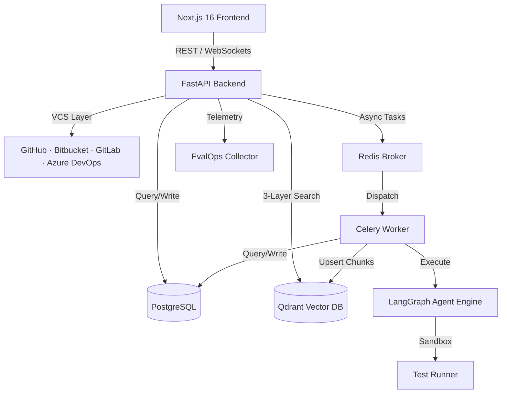

# TestPilot AI

[](https://github.com/Shikhaar/TestPilot-AI/actions)
[](https://github.com/Shikhaar/TestPilot-AI/actions)
[](LICENSE)
[](https://github.com/Shikhaar/TestPilot-AI/pulls)

**TestPilot AI** is an autonomous regression testing platform that analyzes code changes, maps their dependency impact, retrieves relevant code context, generates tests, executes them in isolated environments, diagnoses failures, and creates pull requests — end to end, without manual intervention.

**One-command setup:** `docker compose up -d`

---

## Key Capabilities

- AST-based change and dependency analysis (Tree-sitter)
- 3-layer hybrid codebase RAG (dense vectors + keyword + disk scan)
- Stateful multi-agent test generation (11 specialized LangGraph agents)
- Sandboxed test execution (PyTest, Jest, JUnit, Go Test)
- Automated failure diagnosis with root-cause reporting
- Multi-VCS support (GitHub, Bitbucket, GitLab, Azure DevOps)
- 4-category EvalOps telemetry (Pass@1/N, repair rate, token cost)
- GitHub PR automation with structured review comments

---

## Why TestPilot?

Traditional testing requires developers to manually identify affected areas, write tests for every change, and interpret failure output. This is slow, inconsistent, and scales poorly across large codebases.

TestPilot closes this loop by combining static code analysis, dependency graphs, semantic retrieval, and LLM agents into a single automated pipeline. The result is regression coverage that runs on every change, not just when someone has time to write tests.

---

## Dashboard


> Automated regression testing, vector AST indexing, and risk impact analysis dashboard showing repository health metrics, live AI agent telemetry, and quality token analytics.

---

## How It Works

```
Developer opens PR or pushes a commit
           |
           v
  Analyze changed files with Tree-sitter AST
           |
           v
  Map upstream/downstream dependency graph
           |
           v
  Calculate regression blast radius
           |
           v
  Retrieve relevant code context via hybrid RAG
           |
           v
  Generate unit tests matching repo style (LLM)
           |
           v
  Execute tests in isolated sandbox environment
           |
           v
  Diagnose failures, generate root-cause report
           |
           v
  Post structured review comment + open PR
```

---

## Key Engineering Decisions

**Why Tree-sitter?**
Deterministic, language-agnostic AST parsing. Change analysis is based on actual syntax structure rather than LLM interpretation, which keeps the impact graph reliable and auditable.

**Why LangGraph?**
Stateful orchestration with conditional branching, retries, and failure recovery. Each agent node is independently testable and observable, making the pipeline debuggable rather than a black box.

**Why separate agents rather than one prompt?**
Each stage — planning, diff parsing, dependency traversal, retrieval, generation, execution, failure analysis — has distinct inputs, outputs, and failure modes. Separating them makes the system easier to observe, retry selectively, and extend.

**Why Qdrant?**
Dense vector retrieval over repository code with 384-dimensional embeddings. Combined with PostgreSQL keyword search and a disk scanner, this gives three independent retrieval strategies that complement each other.

**Why Celery + Redis?**
Test generation and sandboxed execution are expensive and long-running. Moving them out of the synchronous API path keeps the backend responsive and allows the frontend to stream real-time progress updates.

**Why sandboxed execution?**
Generated tests must not run against the host environment directly. Subprocess isolation prevents generated code from having side effects on the running system.

---

## System Architecture

```
              Next.js 16 Frontend
                      |
                 FastAPI Backend
                /     |      \
        LangGraph   Qdrant   Celery + Redis
         Agents      RAG     Async Workers
            |
       Test Sandbox
    (PyTest / Jest / JUnit)
```

Full component topology with database and telemetry layers is documented in [System Architecture](docs/architecture.md).



---

## The 11 LangGraph Agents

The agents are separated by responsibility to keep planning, static analysis, retrieval, generation, execution, and failure diagnosis independently testable and observable.

| # | Agent | Responsibility |
| :--- | :--- | :--- |
| 1 | **Planner** | Validates pipeline requests and normalizes execution state |
| 2 | **Diff** | Parses Git diffs and maps changed line ranges to Tree-sitter AST nodes |
| 3 | **Dependency** | Queries the static import graph to build upstream/downstream call graph |
| 4 | **Impact** | Traverses the graph to calculate regression blast radius |
| 5 | **Search** | Retrieves relevant code snippets via 3-layer hybrid RAG |
| 6 | **Test Discovery** | Indexes existing test frameworks and identifies coverage gaps |
| 7 | **Test Generator** | Synthesizes unit tests matching repository code style via LLM |
| 8 | **Execution** | Runs tests in isolated subprocess environments |
| 9 | **Failure Analysis** | Parses stdout/stderr and generates root-cause diagnostic reports |
| 10 | **Review** | Aggregates risk metrics and generated code into PR review comments |
| 11 | **Documentation** | Detects API documentation drift and generates spec updates |

---

## Engineering Metrics

| Metric | Value |
| :--- | :--- |
| LangGraph agent nodes | 11 |
| Code search layers | 3 (dense vector · keyword · disk scan) |
| EvalOps telemetry categories | 4 (Pass@1/N · repair rate · token cost · latency) |
| VCS providers supported | 5 (GitHub · Bitbucket · GitLab · Azure DevOps · PAT) |
| Embedding dimensions | 384-dim dense vectors (Sentence-Transformers) |
| Test frameworks supported | PyTest · Jest/Vitest · JUnit · Go Test |

---

## Tech Stack

**AI & Intelligence**
LangGraph · Tree-sitter · LiteLLM · Instructor · Sentence-Transformers · Qdrant RAG

**Backend**
Python 3.12 · FastAPI · Async SQLAlchemy 2 · Alembic · Pydantic v2 · Poetry

**Async Infrastructure**
Celery 5 · Redis 7 · Subprocess sandboxing

**Observability**
Prometheus · Grafana · OpenTelemetry · Celery Flower · EvalOps

**Frontend**
Next.js 16 · React 19 · TailwindCSS · CSS Modules

**Storage**
PostgreSQL 16 · Qdrant Vector DB

---

## Quickstart

```bash
git clone https://github.com/Shikhaar/TestPilot-AI.git
cd TestPilot-AI
cp .env.example .env
docker compose up -d
docker compose exec backend alembic upgrade head
```

Open `http://localhost:3000`.

See the [Developer Setup Guide](docs/setup.md) for local development, environment variables, and service endpoints.

---

## Engineering & System Documentation

| Document | Description | Key Concepts |
| :--- | :--- | :--- |
| [**System Architecture**](docs/architecture.md) | Decoupled platform topology & component interactions | Next.js 16, FastAPI, PostgreSQL, Qdrant, Celery |
| [**Project Overview**](docs/PROJECT_OVERVIEW.md) | Comprehensive platform overview & system capabilities | End-to-end PR review pipeline & AST impact mapping |
| [**Multi-VCS Provider Architecture**](docs/features/VCS_PROVIDERS.md) | Multi-VCS integration & authentication model | GitHub, Bitbucket, GitLab, Azure DevOps, PAT tokens |
| [**EvalOps Telemetry Engine**](docs/features/EVALOPS_AND_TELEMETRY.md) | Quality benchmarks, repair metrics & token analytics | Pass@1/Pass@N, repair success rate, token cost |
| [**3-Layer Code Search Engine**](docs/features/CODE_SEARCH_AND_INDEXING.md) | Parallel multi-layer code retrieval architecture | Dense vectors, PostgreSQL ILIKE, disk scanner |
| [**Test Generation & Verification**](docs/features/TEST_GENERATION_AND_VERIFICATION.md) | Multi-agent test synthesis & self-healing verification | Exit codes, pytest/jest JSON reports, self-healing |
| [**GitHub OAuth & Session Security**](docs/features/GITHUB_OAUTH_AND_SECURITY.md) | Enterprise authentication & security model | GitHub OAuth 2.0, JWT, zero password storage |
| [**Monitoring & Telemetry**](docs/features/MONITORING_AND_TELEMETRY.md) | Queue monitoring & graceful fallback UI | Celery latency, Prometheus metrics, fallback banners |
| [**Developer Setup Guide**](docs/setup.md) | Containerized and local development guide | Docker Compose, env vars, alembic migrations |
| [**Implementation Roadmap**](docs/plans/01_INITIAL_IMPLEMENTATION_PLAN.md) | Chronological development roadmap & milestones | Phase-by-phase implementation logs |
| [**Release v1.1.0 Record**](docs/plans/05_RELEASE_V1_1_MULTIVCS_AND_PARALLEL_LANGGRAPH.md) | Release v1.1.0 features & test results | Multi-VCS, secured webhooks, parallel LangGraph |
| [**Version 2.0.0 Roadmap**](docs/plans/06_VERSION2_ROADMAP.md) | v2.0 enterprise roadmap & milestones | Docker sandbox, auto-remediation, RBAC |

---

## License

Distributed under the **MIT License**. See `LICENSE` for details.
