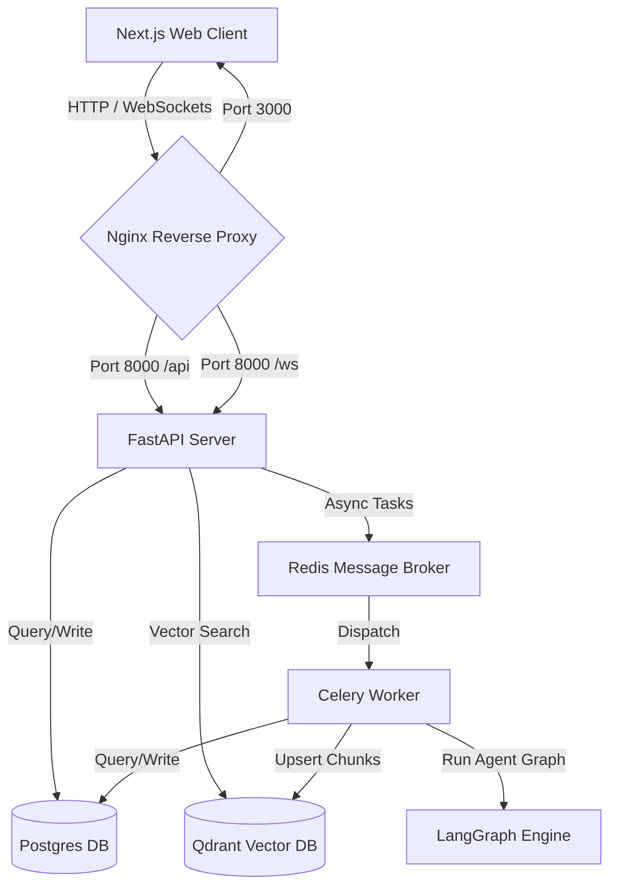

# TestPilot AI — System Architecture

TestPilot AI is structured as a decoupled backend-frontend system with background workers and a vector database.

## System Components

### 1. API Backend (`backend/app`)
Powered by FastAPI, this handles:
- REST endpoints for user authentication, repository registration, PR detail retrieval, and manual analysis triggers.
- Webhook endpoints to ingest GitHub event payloads asynchronously.
- WebSockets to stream real-time analysis pipeline logs and repository indexing status to the client.

### 2. Distributed Task Worker (`celery`)
Executes computationally intensive and slow-running operations:
- **Repository Indexing**: Clones repositories, extracts file syntax trees via Tree-sitter, computes import relationships, produces code embeddings, and updates PostgreSQL/Qdrant.
- **PR Pipeline Analysis**: Invokes the LangGraph agent graph, coordinates test suite executions, and uploads results.

### 3. Database Layer
- **PostgreSQL**: Stores relational schemas for users, connected repositories, PR structures, past test suite execution summaries, and AI reviews.
- **Qdrant**: Stores vector embeddings representing code fragments (classes, functions, routing nodes) for hybrid search retrieval.
