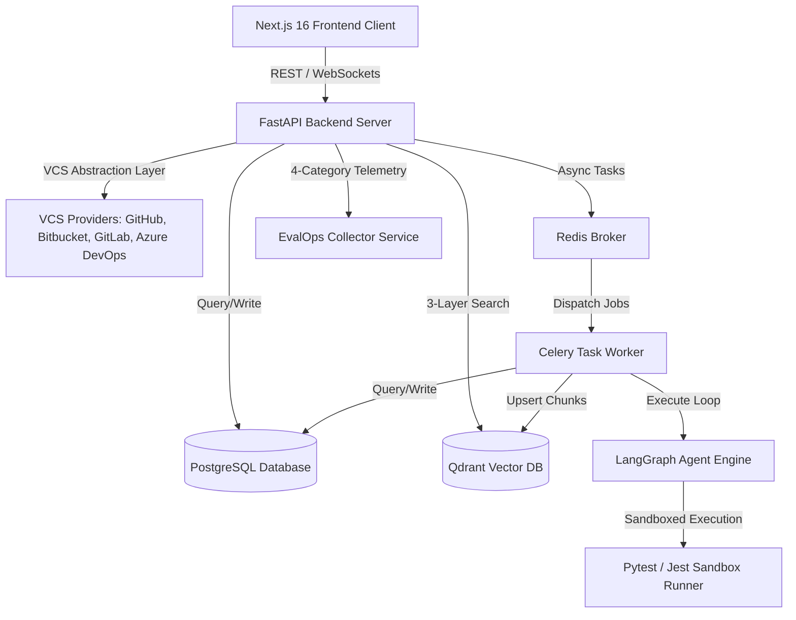

# TestPilot AI — System Architecture (Present State)

TestPilot AI is structured as an enterprise-grade, decoupled web application with background distributed task workers, vector search indexing, multi-VCS provider integration, and an EvalOps telemetry engine.

---

## Architecture Diagram

```mermaid
graph TD
 Client[Next.js 16 Frontend Client] -->|REST / WebSockets| FastAPI[FastAPI Backend Server]

 FastAPI -->|VCS Abstraction Layer| VCS[VCS Providers: GitHub, Bitbucket, GitLab, Azure DevOps]
 FastAPI -->|Async Tasks| Redis[Redis Broker]
 Redis -->|Dispatch Jobs| Celery[Celery Task Worker]

 FastAPI -->|Query/Write| PG[(PostgreSQL Database)]
 Celery -->|Query/Write| PG

 FastAPI -->|3-Layer Search| Qdrant[(Qdrant Vector DB)]
 Celery -->|Upsert Chunks| Qdrant

 FastAPI -->|4-Category Telemetry| EvalOps[EvalOps Collector Service]

 Celery -->|Execute Loop| LangGraph[LangGraph Agent Engine]
 LangGraph -->|Sandboxed Execution| Sandbox[Pytest / Jest Sandbox Runner]
```

---

## Core Architecture Components

### 1. Web Client (`frontend/src`)
- Built with **Next.js 16**, **React 19**, **TailwindCSS**, and Lucide icons.
- Features Multi-VCS Repository Connect Modal (GitHub, Bitbucket 1-Click OAuth 2.0, GitLab, Azure DevOps, Custom Git), Repository Selector scoping, 3-Layer Code Search, interactive PR analysis, and the Live **EvalOps Telemetry Dashboard**.

### 2. API Backend (`backend/app`)
- Powered by **FastAPI**, **Async SQLAlchemy 2**, and **Pydantic v2**.
- Implements Multi-VCS Provider Abstraction Layer (`vcs_base.py`), upfront REST API validation, GitHub OAuth 2.0 & 1-Click Dev Authentication, JWT session management, 3-layer hybrid code search (`Qdrant` + `PostgreSQL` + `Disk`), and EvalOps telemetry endpoints.

### 3. VCS Provider Abstraction (`backend/app/services/vcs/`)
- Unified `VCSProvider` interface abstracting repository metadata fetching, PAT authentication headers, and HTTPS clone URL token injections for **GitHub**, **Bitbucket**, **GitLab**, **Azure DevOps**, and **Generic Git**.

### 4. Task Worker (`celery` & `FastAPI BackgroundTasks`)
- Handles non-interactive background repository indexing (`GIT_TERMINAL_PROMPT="0"`), AST parsing via Tree-sitter, embedding generation, remote branch fallbacks, and PR pipeline execution.

### 5. Vector, Relational & Telemetry Storage
- **PostgreSQL**: Stores relational models for Users, Repositories, RepositoryFiles, PR Analyses, and Generated Tests with automatic schema migration on startup.
- **Qdrant**: Stores 384-dimensional dense vectors (`code_symbols` and `repository_chunks`) for hybrid semantic code retrieval.
- **EvalOps Collector**: Collects Pass@1/Pass@N quality benchmarks, self-healing iteration repair metrics, token consumption, and time-series trends.
