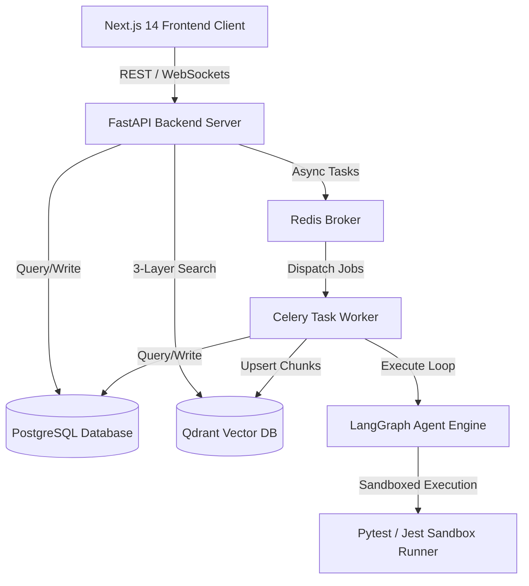

# TestPilot AI — System Architecture (Present State)

TestPilot AI is structured as an enterprise-grade, decoupled web application with background distributed task workers and vector search indexing.

---

## Architecture Diagram

```mermaid
graph TD
 Client[Next.js 14 Frontend Client] -->|REST / WebSockets| FastAPI[FastAPI Backend Server]
 
 FastAPI -->|Async Tasks| Redis[Redis Broker]
 Redis -->|Dispatch Jobs| Celery[Celery Task Worker]
 
 FastAPI -->|Query/Write| PG[(PostgreSQL Database)]
 Celery -->|Query/Write| PG
 
 FastAPI -->|3-Layer Search| Qdrant[(Qdrant Vector DB)]
 Celery -->|Upsert Chunks| Qdrant
 
 Celery -->|Execute Loop| LangGraph[LangGraph Agent Engine]
 LangGraph -->|Sandboxed Execution| Sandbox[Pytest / Jest Sandbox Runner]
```

---

## Core Architecture Components

### 1. Web Client (`frontend/src`)
- Built with Next.js 14, TailwindCSS, and Lucide icons.
- Features Repository Selector scoping, 3-Layer Code Search, interactive PR analysis, and telemetry fallback banners.

### 2. API Backend (`backend/app`)
- Powered by FastAPI.
- Implements GitHub OAuth 2.0 authentication, JWT session management, 3-layer hybrid code search (`Qdrant` + `PostgreSQL` + `Disk`), and REST endpoints.

### 3. Task Worker (`celery`)
- Handles background repository indexing, AST parsing via Tree-sitter, embedding generation, and PR pipeline execution.

### 4. Vector & Relational Storage
- **PostgreSQL**: Stores relational models for Users, Repositories, RepositoryFiles, PR Analyses, and Generated Tests.
- **Qdrant**: Stores 384-dimensional dense vectors (`code_symbols` and `repository_chunks`) for code search retrieval.
