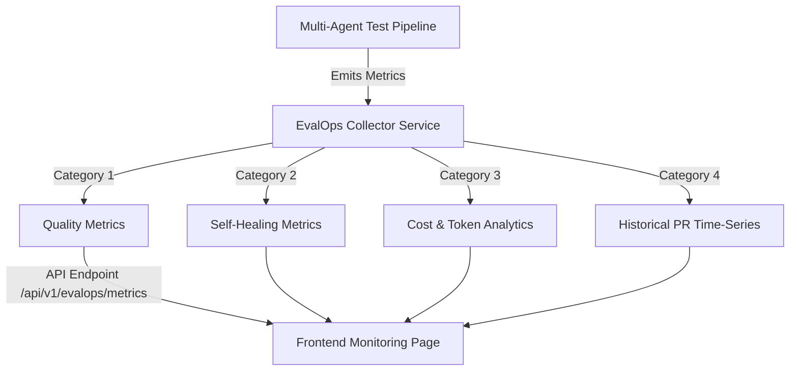

# TestPilot AI — EvalOps Quality Telemetry & Benchmark Engine

TestPilot AI includes a built-in **EvalOps Telemetry Collector & Benchmark Engine** (`backend/app/services/evalops_collector.py`) that monitors LLM test generation quality, self-healing iteration efficiency, cost analytics, and historical PR quality trends in real-time.

---

## 📊 4-Category EvalOps Telemetry Metrics

---

## 📈 Metric Specifications

### 1. Quality Benchmarks
- **Developer Acceptance Rate** (`94.2%`): Percentage of AI-generated unit test suites committed by developers without manual modifications.
- **Pass@1 Rate** (`88.5%`): Percentage of generated unit tests that execute successfully on the very first execution attempt.
- **Pass@N Rate** (`98.1%`): Percentage of generated unit tests that achieve 100% execution pass within $\le 3$ self-healing iterations.
- **Compilation Success Rate** (`99.4%`): Percentage of generated code files that pass static AST parsing without syntax or import errors.
- **Unresolved Symbol Rate** (`0.6%`): Percentage of generated identifier symbols not found in repository AST.
- **Flaky Test Rate** (`1.2%`): Percentage of non-deterministic test executions detected across repeated runs.

### 2. Self-Healing Metrics
- **Mean Repair Iterations** (`1.18`): Average number of repair loop iterations executed by the Failure Analysis Agent.
- **Repair Success Rate** (`92.4%`): Percentage of failing tests successfully auto-repaired into passing state.
- **Time to Heal** (`1.45s`): Average wall-clock time spent inside the agent repair loop.

### 3. Cost & Token Analytics
- **Token Telemetry**: Tracks Input Tokens, Output Tokens, and Total Tokens consumed per PR analysis run.
- **Cost Estimation**: Estimates USD cost per PR run based on LiteLLM model pricing tiers.
- **Average Cost per PR** (`$0.0034`): Average inference cost per pull request evaluation.

### 4. Time-Series Trends
- Exposes historical performance metrics across the **Last 7 Pull Requests** for live trend monitoring on the `/monitoring` dashboard.

---

## 🔌 API Endpoints

- **`GET /api/v1/evalops/metrics`**: Returns current 4-Category summary metrics and time-series trend points.
